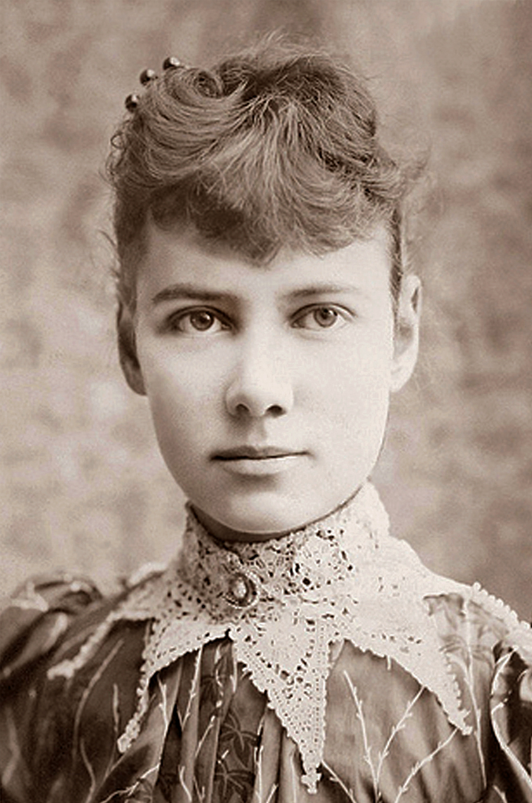

### **Biographical Information**
###### **Full Name:** Elizabeth Jane Cochran Seaman
###### **Born:** May 5, 1864
######  **Died:** January 27, 1922
######  **Occupation:** Journalist, Inventor 
######  **Most Famous For:** Investigative Journalism

### **Her Story**
###### Nellie Bly was an incredible woman who launched a new type of investigative journalism. She is known mainly for two things: her trip around the world and her work exposing the abuses in mental institutions. In 1888, she went around the world in seventy-two days by boat for her editor, which was at the time, a record. She also faked insanity to get inside a mental institution on Blackwell's Island (now known as Roosevelt Island). She witnessed the treatment and abuse in asylums for ten days and later published them in book form, which caused national reform. 

####  **Fun Fact!** At 31, Bly got married to a man 42 years older than her.
