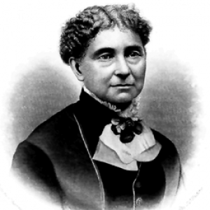

### **Biographical Information**
###### **Full Name:** Amelia Jenks Bloomer
###### **Born:** May 27, 1818
######  **Died:** December 30, 1894
######  **Occupation:** Women's Rights and Temperance Activist, Newspaper Owner 
######  **Most Famous For:** Popularized pants for women and was first woman to own a newspaper for women.

### **Her Story**
###### Amelia Bloomer first became involved with women's rights when she attended the Seneca Falls Convention in 1848, and soon after started to edit for the first newspaper for women. It was originally as a temperance journal for the Seneca Falls Temperance Society, but eventually under the influence of heroines like Susan B. Anthony and Elizabeth Cady Stanton, became a paper with a wide range of issues, from recipes to moralistic tracts. When the Society lost interest in the paper, Bloomer took over all major duties to keep it running. She popularized the idea of pants under dresses by wearing them and writing about them in the paper, and they were eventually dubbed bloomers after her.

####  **Fun Fact!** She stopped wearing bloomers after she said the dress was sufficentially reformed in 1859.
