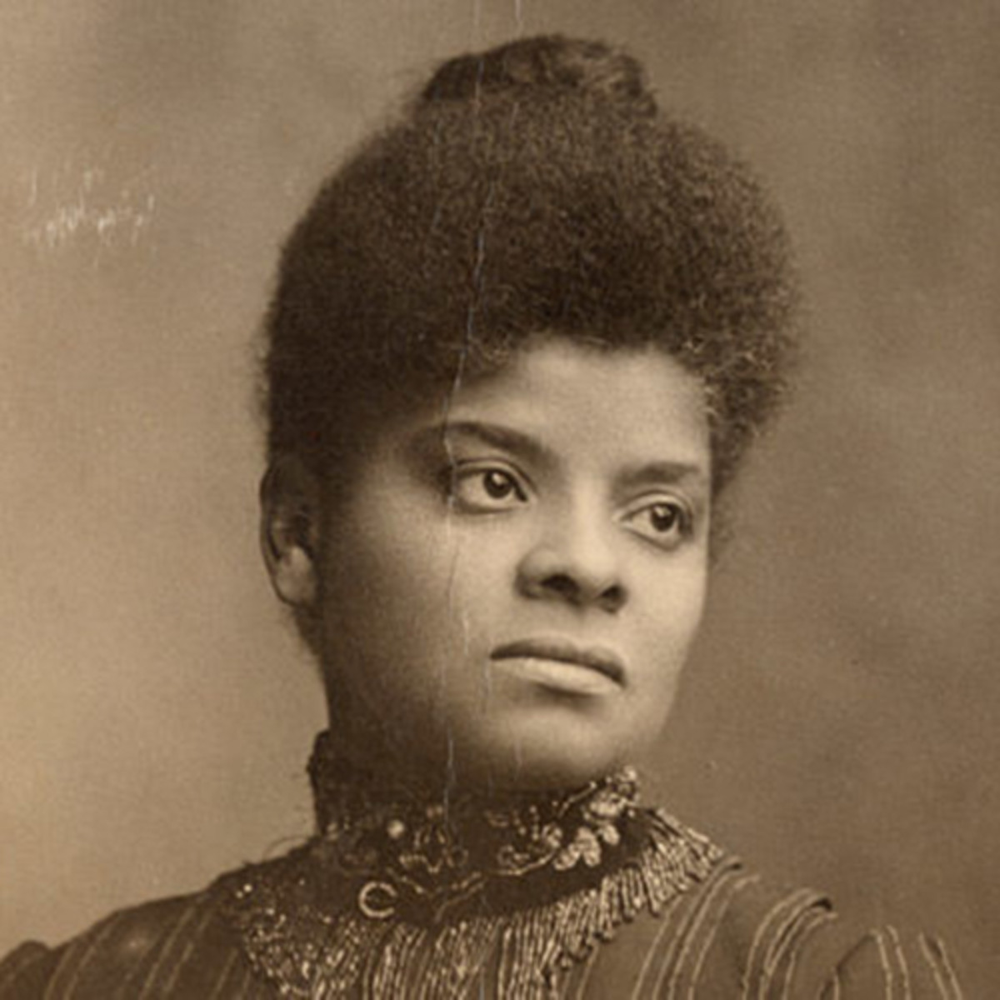

### **Biographical Information**
###### **Full Name:** Ida Bell Wells-Barnett
###### **Born:** July 16, 1862
######  **Died:** March 25, 1931
######  **Occupation:** Teacher, Editor, Journalist, Activist 
######  **Most Famous For:** Co-Founder of NAACP

### **Her Story**
###### There is a lot to say about Ida B. Wells-Barnett. Born into slavery, she was freed by the Emancipation Act and started to work as a teacher. She co-founded her own newspaper and wrote for it as well. She reported on lynchings and civil-rights cases, and went on tours around the country and the U.K. speaking about these issues. She was originally excluded from the NAACP founders list, which Du Bois defended in his autobiography saying she wished not to be included (she denied this). As if this wasn't enough, she also fought for women's rights in Chicago.

####  **Fun Fact!** During WWI, the U.S. government flagged her as a dangerous "race agitator."
