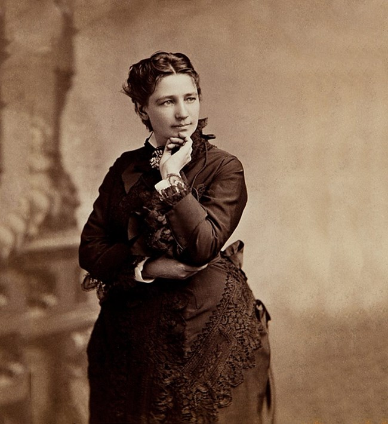

### **Biographical Information**
###### **Full Name:** Victoria Claflin Woodhull
###### **Born:** September 23, 1838
######  **Died:** June 9, 1927 
######  **Occupation:** Politician, Stockbroker, Writer 
######  **Most Famous For:** Being First Female Presidential Candidate

### **Her Story**
###### Victoria Woodhull became along with her sister Tennessee Clafin the first female stockbrokers and in 1870 opened a brokerage firm. Using the money they earned from the brokerage firm, Woodhull and her sister also created a newspaper that at its height was read by more than 20,000 people. It exposed that Henry Ward Beecher, a preacher who condemned Woodhull's idea of free love (freedom to marry, divorce, and bear children without government interference), had committed adultery, and one of the biggest cases of the era started because of it. Her newspaper was mainly dedicated to her run for office, which she was the first woman to do so in 1872. Even though he never addressed his nomination, Frederick Douglass was her VP.  She ran in the newly-formed Equal Rights Party, but was arrested soon after due to the article described above.

####  **Fun Fact!** Some historians argue she wasn't the first female presidential candidate because  she ran months away from turning thirty-five, but the media at the time never mentioned this. She never got any electoral votes.
