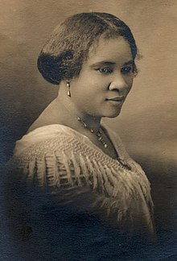

### **Biographical Information**
###### **Full Name:** Sarah Breedlove
###### **Born:** December 23, 1867
######  **Died:** May 25, 1919
######  **Occupation:** Hair-care entrepreneur, philanthropist 
######  **Most Famous For:** Being first female millionaire in U.S.

### **Her Story**
###### Madam C.J. Walker worked as a laundress when her first husband died to support her two-year-old daughter, but soon started selling products for Annie Malone (she would be Walker's fiercest competitor in later years and also a millionaire) for African-American women's hair. Back then, black women would often have severe dandruff, scalp ailments, and even baldness due to lye and other harsh products. While she was working for Malone, she started creating her own line, and had her daughter deal with mail orders while she and her new husband opened hair salons, a factory, and a school when Madame C. J. Walker Manufacturing Company truly flourished, and the sales agents even worked in the Caribbean.
