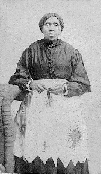

### **Biographical Information**
###### **Full Name:** Harriet Powers
###### **Born:** October 29, 1839
######  **Died:** January 1, 1910 
######  **Occupation:** Quilt-maker, Seamstress 
######  **Most Famous For:** Quilt Making

### **Her Story**
###### Harriet Powers was born into slavery in Georgia, where she learned to sew and started to read the Bible, which later inspired her quilts. She exhibited her first quilt in 1886, now in the Smithsonian, and it displayed what would become a pattern in her work. She stitched her quilts both by hand and by machine, and they depicted biblical and celestial scenes and stories, with clear African and African-American influences. There are only two of quilts that are known to exist still and both are in museums.

####  **Fun Fact!** October 30, 2010, was Harriet Powers Day.
