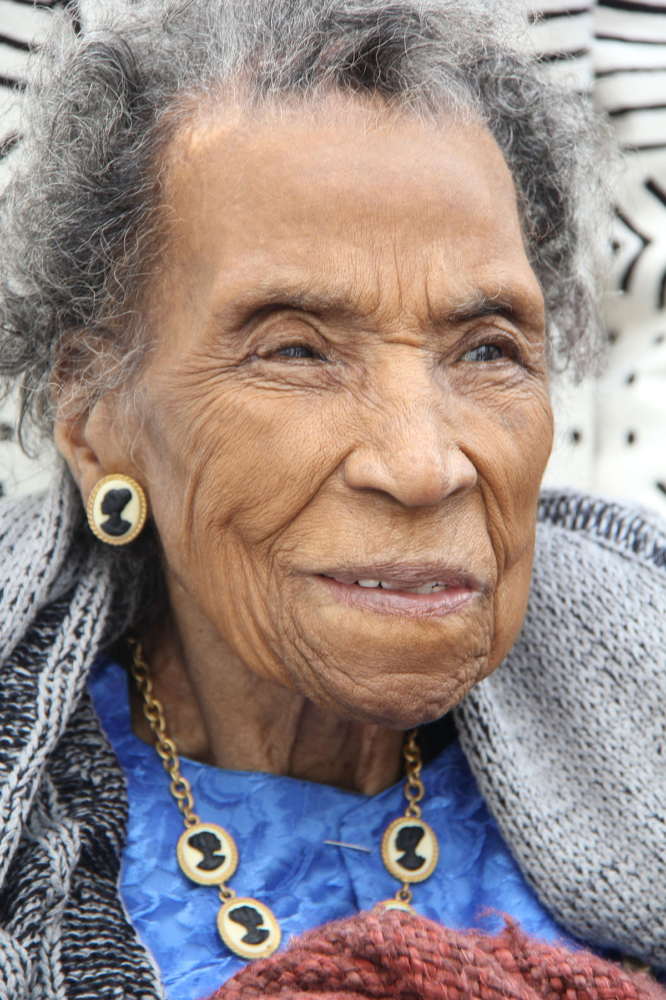

### **Biographical Information**
###### **Full Name:** Amelia Isadora Platts Boynton Robinson
###### **Born:** August 18, 1911
######  **Died:** August 26, 2015
######  **Occupation:** Teacher, Activist
######  **Most Famous For:** Civil-Rights Activism

### **Her Story**
###### Amelia Boynton Robinson was registered to vote in 1934, which was extremely hard to do in for a black woman in Alabama at that time. She worked with famous activists to create marches and protests for voting and civil rights. She organized the march to Montgomery which ended up being Bloody Sunday. She marched during that, which she ended up getting severe throat burns from the tear gas, and marches afterwards in protest to Bloody Sunday. When LBJ signed the Voting Rights Act into law, she was a guest of honor.

####  **Fun Fact!** Her son was arrested while trying to purchase food in a white terminal, and his case ended up in the Supreme Court, which overturned his conviction.
